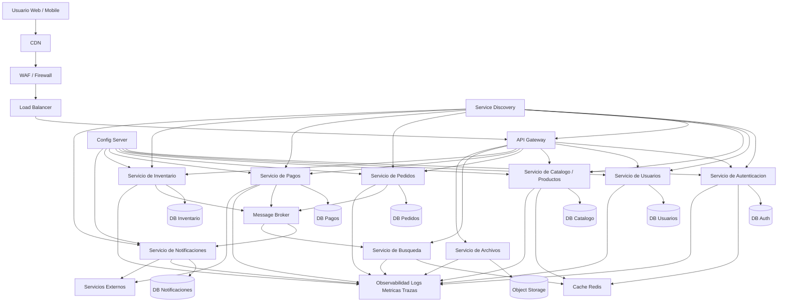

# Diagrama de arquitectura de microservicios

```mermaid
flowchart TB
    U[Usuario Web / Mobile]
    CDN[CDN]
    WAF[WAF / Firewall]
    LB[Load Balancer]
    AG[API Gateway]
    AUTH[Servicio de Autenticacion]
    USER[Servicio de Usuarios]
    PROD[Servicio de Catalogo / Productos]
    ORD[Servicio de Pedidos]
    PAY[Servicio de Pagos]
    INV[Servicio de Inventario]
    NOTI[Servicio de Notificaciones]
    SEARCH[Servicio de Busqueda]
    FILES[Servicio de Archivos]
    MQ[Message Broker]
    CACHE[Cache Redis]
    CONFIG[Config Server]
    DISC[Service Discovery]
    OBS[Observabilidad Logs Metricas Trazas]
    DB1[(DB Auth)]
    DB2[(DB Usuarios)]
    DB3[(DB Catalogo)]
    DB4[(DB Pedidos)]
    DB5[(DB Pagos)]
    DB6[(DB Inventario)]
    DB7[(DB Notificaciones)]
    OBJ[(Object Storage)]
    EXT[Servicios Externos]

    U --> CDN --> WAF --> LB --> AG
    AG --> AUTH
    AG --> USER
    AG --> PROD
    AG --> ORD
    AG --> PAY
    AG --> INV
    AG --> SEARCH
    AG --> FILES

    AUTH --> DB1
    USER --> DB2
    PROD --> DB3
    ORD --> DB4
    PAY --> DB5
    INV --> DB6
    NOTI --> DB7
    FILES --> OBJ

    ORD --> MQ
    PAY --> MQ
    INV --> MQ
    MQ --> NOTI
    MQ --> SEARCH

    AUTH --> CACHE
    PROD --> CACHE
    SEARCH --> CACHE

    CONFIG --> AUTH
    CONFIG --> USER
    CONFIG --> PROD
    CONFIG --> ORD
    CONFIG --> PAY
    CONFIG --> INV
    CONFIG --> NOTI

    DISC --> AG
    DISC --> AUTH
    DISC --> USER
    DISC --> PROD
    DISC --> ORD
    DISC --> PAY
    DISC --> INV
    DISC --> NOTI

    AUTH --> OBS
    USER --> OBS
    PROD --> OBS
    ORD --> OBS
    PAY --> OBS
    INV --> OBS
    NOTI --> OBS
    SEARCH --> OBS
    FILES --> OBS

    PAY --> EXT
    NOTI --> EXT
```

> Archivo creado para usar como enlace del TP de Desarrollo Web.
